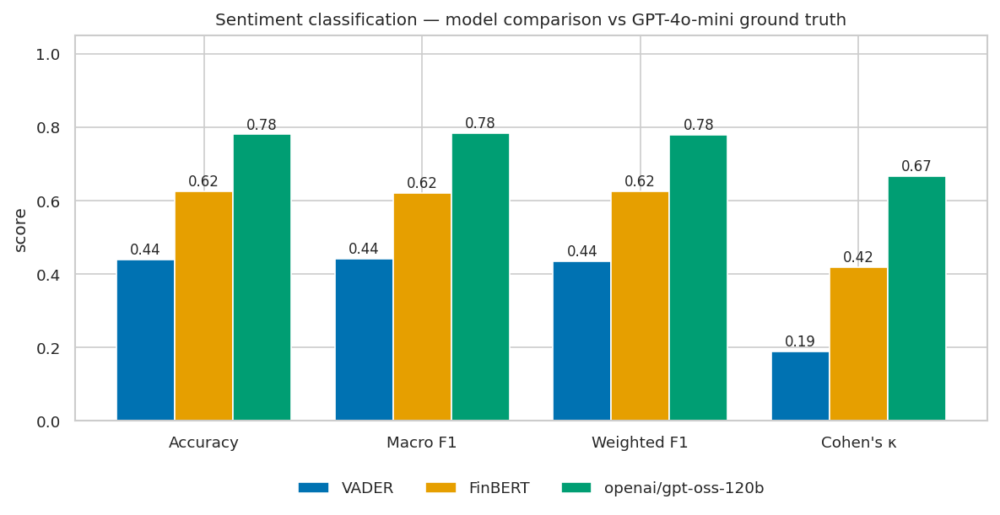
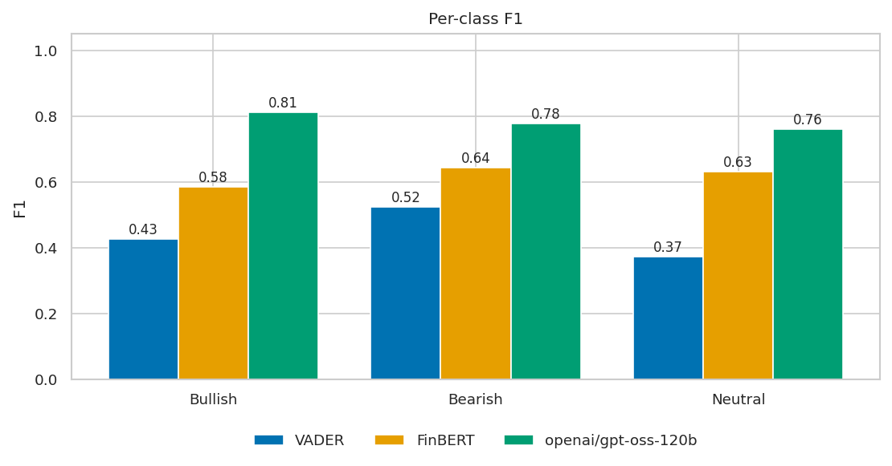
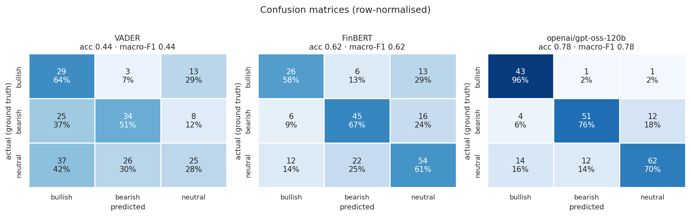
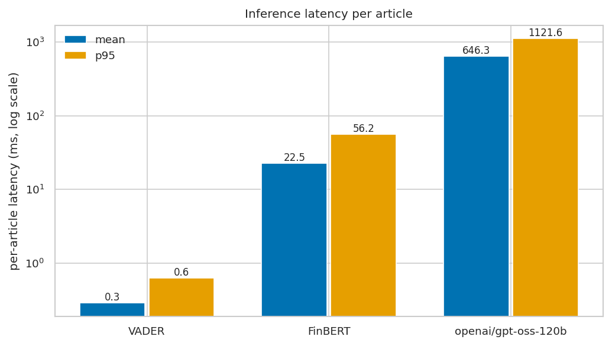

# FinPulse — Model Evaluation Report

_Generated 2026-09-08 03:25 UTC_

This report compares three sentiment-classification approaches — a lexicon baseline (**VADER**), a domain-tuned transformer (**FinBERT**, `ProsusAI/finbert`), and a large instruction-tuned LLM (**openai/gpt-oss-120b** via Groq) — on financial news headlines, and evaluates the platform's semantic-search retrieval. All predictions, judgements and intermediate artefacts are written to CSV for reproducibility.

## 1. Methodology

### 1.1 Test set

- **200 articles** sampled from the platform's Postgres store (200 labelled), stratified by source with a per-source cap and a fixed RNG seed (`scripts/eval/dataset.py`).
- Each item is the article **headline plus available body text** — the same input the production pipeline scores.
- Ground-truth label distribution: **bullish** 45, **bearish** 67, **neutral** 88.

### 1.2 Ground truth

- Labelled by **OpenAI `gpt-4o-mini`**, which is *not* one of the systems under test — this keeps the reference labels independent of VADER, FinBERT and the Groq LLM.
- A fixed 3-class **market-impact rubric** (bullish / bearish / neutral) is used; see `scripts/eval/labeler.py`.
- **Self-consistency check:** every article is labelled twice — once at temperature 0, once at 0.5. The final label is the temperature-0 pass; the two passes agree on **198/200** items (99.0%), a chance-corrected agreement of κ ≈ **0.98** (approximated from the agreement rate and the label marginals — the second pass's individual labels are not retained). The per-item agreement is recorded as `gt_stable`; metrics are reported on the full set and on the stable subset.

### 1.3 Systems under test

| System | Type | Decision rule |
|---|---|---|
| VADER | lexicon + heuristics | compound > 0.05 → bullish; < −0.05 → bearish; else neutral |
| FinBERT | BERT fine-tuned on financial text | arg-max of {positive, negative, neutral} → {bullish, bearish, neutral} |
| openai/gpt-oss-120b | instruction-tuned LLM, zero-shot | same rubric as ground truth, `reasoning_effort=low`, temp 0 |

### 1.4 Retrieval evaluation

- **20 topical queries** run against a dedicated ChromaDB collection built from the 200-article test set (MiniLM `all-MiniLM-L6-v2`, cosine).
- Each (query, hit) pair in the top-10 is judged relevant / not by **`gpt-4o-mini`** (LLM-as-judge); see `scripts/eval/rag_eval.py`.
- Metrics: **Precision@5**, **Precision@10**, **MRR**, macro-averaged over the 20 queries.

## 2. Sentiment classification results

### 2.1 Headline metrics (full test set, n = 200)

| Model | Accuracy | Macro P | Macro R | Macro F1 | Weighted F1 | κ vs GT |
|---|---|---|---|---|---|---|
| VADER | 44.0% | 46.7% | 47.9% | **44.1%** | 43.5% | 0.189 |
| FinBERT | 62.5% | 61.9% | 62.1% | **62.0%** | 62.5% | 0.419 |
| openai/gpt-oss-120b | 78.0% | 77.6% | 80.7% | **78.4%** | 77.8% | 0.666 |

### 2.2 Headline metrics (stable-label subset, n = 198)

| Model | Accuracy | Macro F1 | Weighted F1 | κ vs GT |
|---|---|---|---|---|
| VADER | 44.4% | **44.6%** | 44.0% | 0.196 |
| FinBERT | 63.1% | **62.6%** | 63.1% | 0.429 |
| openai/gpt-oss-120b | 78.8% | **79.2%** | 78.6% | 0.678 |

### 2.3 Per-class F1 (full set)

| Model | Bullish | Bearish | Neutral |
|---|---|---|---|
| VADER | 0.43 (n=45) | 0.52 (n=67) | 0.37 (n=88) |
| FinBERT | 0.58 (n=45) | 0.64 (n=67) | 0.63 (n=88) |
| openai/gpt-oss-120b | 0.81 (n=45) | 0.78 (n=67) | 0.76 (n=88) |

### 2.4 Confusion matrices

**VADER** — rows = actual, columns = predicted:

| actual ↓ / pred → | bullish | bearish | neutral |
|---|---|---|---|
| bullish | 29 | 3 | 13 |
| bearish | 25 | 34 | 8 |
| neutral | 37 | 26 | 25 |

**FinBERT** — rows = actual, columns = predicted:

| actual ↓ / pred → | bullish | bearish | neutral |
|---|---|---|---|
| bullish | 26 | 6 | 13 |
| bearish | 6 | 45 | 16 |
| neutral | 12 | 22 | 54 |

**openai/gpt-oss-120b** — rows = actual, columns = predicted:

| actual ↓ / pred → | bullish | bearish | neutral |
|---|---|---|---|
| bullish | 43 | 1 | 1 |
| bearish | 4 | 51 | 12 |
| neutral | 14 | 12 | 62 |

## 3. Inference cost

| Model | Mean / article | Median | p95 | Total (n=200) | Notes |
|---|---|---|---|---|---|
| VADER | 0.3 ms | 0.2 ms | 0.6 ms | 0.1 s | local CPU |
| FinBERT | 22.5 ms | 16.6 ms | 56.2 ms | 4.5 s | local CPU |
| openai/gpt-oss-120b | 646.3 ms | 580.8 ms | 1121.6 ms | 129.3 s | network / API latency |

> VADER and FinBERT run locally (CPU); the Groq figure is end-to-end API latency including network and queueing, not model compute, and is rate-limited on the free tier.

## 4. Semantic-search retrieval

| Metric | Value |
|---|---|
| Queries | 20 |
| Mean hits / query | 10.0 |
| **Precision@5** | **0.380** |
| **Precision@10** | **0.270** |
| **MRR** | **0.622** |
| Mean query latency | 4.5 ms |

Per-query:

| Query | P@5 | P@10 | RR |
|---|---|---|---|
| Federal Reserve interest rate decision and its effec | 0.20 | 0.10 | 0.20 |
| US inflation data and consumer prices | 0.40 | 0.40 | 0.50 |
| quarterly earnings beat expectations | 0.40 | 0.30 | 1.00 |
| company misses earnings and guidance cut | 0.40 | 0.30 | 0.50 |
| oil prices and energy market volatility | 0.80 | 0.70 | 1.00 |
| Middle East conflict impact on markets | 0.60 | 0.50 | 1.00 |
| AI chip demand and semiconductor stocks | 0.20 | 0.10 | 0.25 |
| big tech layoffs and job cuts | 0.00 | 0.00 | 0.00 |
| cryptocurrency and bitcoin price moves | 0.60 | 0.30 | 1.00 |
| US tariffs and trade policy | 0.40 | 0.20 | 0.50 |
| China economy slowdown and stimulus | 0.20 | 0.10 | 0.50 |
| Treasury yields and bond market stress | 0.80 | 0.60 | 1.00 |
| mergers and acquisitions deal activity | 0.40 | 0.30 | 1.00 |
| regulatory investigation or lawsuit against a compan | 0.40 | 0.40 | 0.50 |
| housing market and mortgage rates | 0.80 | 0.40 | 1.00 |
| stock market rally and record highs | 0.20 | 0.10 | 0.50 |
| bank capital and financial system stability | 0.00 | 0.00 | 0.00 |
| electric vehicle makers and automotive industry | 0.40 | 0.30 | 0.50 |
| airline industry results and travel demand | 0.20 | 0.10 | 1.00 |
| gold and safe-haven assets | 0.20 | 0.20 | 0.50 |

## 5. Discussion

- **openai/gpt-oss-120b** has the highest macro-F1 (78.4%); **VADER** the lowest (44.1%).
- FinBERT vs VADER isolates the value of financial-domain fine-tuning over a general-purpose lexicon on the same headlines.
- The LLM vs FinBERT gap quantifies what a large zero-shot model buys over a small specialised one, against its per-item latency and cost.
- Per-class F1 exposes the usual failure mode: **neutral** is the hardest class, and lexicon methods over-predict it.

## 6. Threats to validity

- **Model-assisted ground truth.** Labels come from a single LLM annotator (`gpt-4o-mini`), not human annotators. The temp-0 / temp-0.5 agreement (κ ≈ 0.98) measures the labeller's *self-consistency*, not its *correctness*, and is no substitute for multi-rater human adjudication. Results on the stable subset (§2.2) mitigate but do not remove this.
- **Shared rubric.** The Groq LLM classifier and the ground-truth labeller use the *same* rubric text, which may advantage the LLM relative to VADER/FinBERT. The rubric encodes a market-impact definition of sentiment that FinBERT was not trained against.
- **Corpus skew.** Articles are recent financial news, source-skewed toward a few outlets; headline-dominant (many RSS items lack body text).
- **LLM-as-judge for retrieval.** Relevance judgements share the judge model family with the labeller; no human qrels.
- **API latency ≠ compute.** Groq timings are not comparable to local CPU timings as a measure of model efficiency.

## 7. Artefacts

| File | Contents |
|---|---|
| `test_set.csv` | article_id, title, content, ground_truth_sentiment, gt_confidence, gt_stable, gt_rationale, source, url |
| `predictions.csv` | per-article predictions + latencies for all 3 models + ground truth |
| `metrics.json` | full metric objects (full set + stable subset) |
| `rag_judgements.csv` | per (query, hit) relevance judgement with similarity |
| `rag_metrics.json` | P@5 / P@10 / MRR overall and per query |
| `figures/*.png` | confusion matrices, model comparison, per-class F1, latency |

_Run time: dataset+labelling 0s · classifiers 2s · RAG 0s._
